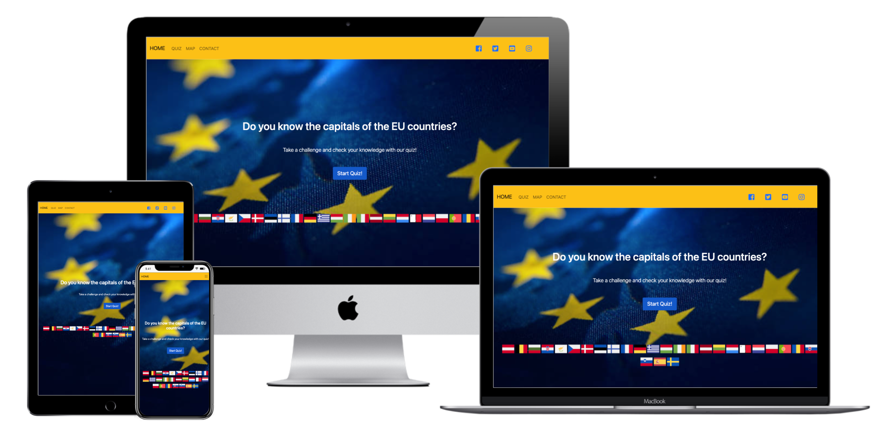

# EU QUIZ

[View life project here](kingaszmyd.github.io/msp2-euquiz/)


## Do you know the capitals of the EU countries?

This project is a promotion of the EU member countries. Going through the quiz the participants need to answer the questions, which describes the capitals of the member countries. There are in total 50 questions, but during one rotation of the quiz participant has to answer 10 questions. Every answer gives 1 point. 

The idea of the project is to promote the knowledge about the EU members countries. That can help also to find out the new facts about the european capitals and encourage the viewers to discover these cities and travel around the Europe. 

## User stories
### First Time Visitor Goals
1. *As a First Time Visitor*, I want to easily understand the main purpose of the site and take part in the quiz and check my knowledge about the subject. 
2. *As a First Time Visitor*, I want to be able to easily navigate throughout the site to take part in the quiz.
### Returning Visitor Goals
1. *As a Returning Visitor*, I want to take part in the quiz and systematize my knowledge about the EU members capitals. 
2. *As a Returning Visitor*, I want to find the best way to get in contact with the organisation with any questions I may have.
3. *As a Returning Visitor*, I want to check the localistaions of the cities on the map.  
4. *As a Returning Visitor*, I want to find community links.
### Frequent User Goals
1. *As a Frequent User*, I want to check to see if there are any newly added questions to the quiz.
2. *As a Frequent User*, I want to check to see if there are any new options and updates of the website, for example forums or newsletter I can sign up to. 
## Design
### Colour Scheme
The three main colours used are: yellow, blue and white.
### Typography
The Oswald font is the main font used throughout the whole website with Sans Serif as the fallback font in case for any reason the font isn't being imported into the site correctly. 
### Imagery
Imagery is important. The large, background image on the index.html page is use to catch the user's attention. 
## Wireframes

* Web page Wireframe 
 
* Tablet Wireframe 
 
* Mobile Wireframe 
 
## Features
The EU Quiz has in total 50 questions, but during one deal the participants have to answer 10 random questions. The users need to answer all of the questions to get maximum amount of points. Every question describes different capital of european country that belongs to the EU. The quiz is dedicated to users, who would like to check they knowledge about european capitals, but also would like to learn new facts about them. This quiz might be useful during the travel, also becouse it contains the map with localizations of the european capitals. If the users have any concerns or questions, they can use the email form to contact with the organisation.
* Responsive on all device sizes
* Interactive elements
### Existing Features
#### Navigation Bar
* Featured on all four pages, the full responsive navigation bar includes links to the Home page, Quiz page, Map page and Contact page and the active icons to the social media, the links of them will open in new tabs. . Navigation bar is identical in each page to allow for easy navigation.
* This section will allow the user to easily navigate from page to page across all devices without having to revert back to the previous page via the ‘back’ button.
#### The home page 
* The home page includes a background image and the START QUIZ button, that allows redirection to the quiz page. 
#### The quiz page
* The quiz page contains the quiz form with the questions, that encourages user imediately to take part with the game.  
#### The map page
* The map page contains responsive Google Map with pointers of the european capitals and info windows with information about them. That helps users to find the cities in the easy way and prepare for the quiz.
#### The contact page
* The contact page gives the information about the organisation address and contains contact form, that allows to send the direct email and easly contact with the organisation. 
#### The footer section 
* The footer section includes flags of 27 countries of EU. The icons are active and redirect the user, after clicking on them, to the Wikipedia pages for getting more information about each country. The links will open in new tabs. Footer  is identical in each page to allow for easy navigation.

### Features Left to Implement
* Another feature idea, like: newsletter, more questions, diffrent levels of quiz. 

## Technologies Used
### Languages Used
* [HTML5](https://en.wikipedia.org/wiki/HTML5)
* [CSS3](https://en.wikipedia.org/wiki/CSS)
* [JavaScript](https://en.wikipedia.org/wiki/JavaScript)

### Frameworks, Libraries & Programs Used
1. [Bootstrap 5.0.2.](https://getbootstrap.com/docs/versions/):
* Bootstrap was used to assist with the responsiveness and styling of the website. Navbar and responsive images were created by using Bootstrap libraries.
2. [Hover.css](https://developer.mozilla.org/en-US/docs/Web/CSS/:hover):
* Hover.css was used on the buttons in the quiz to add the changing color options while being hovered over.
3. [Google Fonts](https://fonts.google.com/):
* Google fonts were used to import the 'Oswald' font into the style.css file which is used on all pages throughout the project.
4. [Font Awesome](https://fontawesome.com/):
* Font Awesome was used on all pages throughout the website to add icons of social media for aesthetic and UX purposes.
5. [Git](https://www.gitpod.io/):
* Git was used for version control by utilizing the Gitpod terminal to commit to Git and Push to GitHub.
6. [GitHub](https://github.com/):
* GitHub is used to store the projects code after being pushed from Git.
7.  [Balsamiq](https://balsamiq.com/):
* Balsamiq was used to create the wireframes during the design process.
8. [Techsini.com](https://techsini.com/multi-mockup/)
* Multi Device Website Mockup Generator that helps with creating mockups of the website and allows to check its responsivness at different devices. 
## Testing
1. Browsers:
* [Chrome](https://kingaszmyd.github.io/MSP2-EUQuiz/index.html)
* [Safari](https://kingaszmyd.github.io/MSP2-EUQuiz/index.html)
2. Devices:
The website was viewed on a variety of devices such as Desktop, Laptop, iPhone7, iPhone 8 & iPhoneX.
3. Bugs: 
* CSS: 
The buggs occures with the Bootstrap and concerned paddings and img-thumbnail. They were detected after using the Developer Tools from Google Chrome and overwrite by the !important command in css stylesheet.
#### Case 1

`ul, li {
    padding-left: 0 !important;
    padding-right: 0 !important;
}`

#### Case 2

`.img-thumbnail {
    border: none !important; 
    width: 220px;
}`

* JavaScript:
After validation the code the following buggs were discovered:

#### Case 1
For keeping declarations: let and const, all JavaScript files start from the  [/*jshint esversion: 6 */](https://stackoverflow.com/questions/27441803/why-does-jshint-throw-a-warning-if-i-am-using-const)
#### Case 2
For avoiding error that function is not defined, [/* exported initMap */](https://stackoverflow.com/questions/19763987/jshint-myfunction-is-defined-but-never-used) declaration was used.

```javascript
/* exported initMap */
function initMap() { 
  map = new google.maps.Map(document.getElementById("map"), {
    center: { lat: 54.525961, lng: 15.255119 },
    zoom: 8,
  });
}
function initMap() { 
    map = new google.maps.Map(document.getElementById("map"), {
      zoom: 3,
      center: { lat: 54.525961, lng: 15.255119 },
    });
  ```
## Validator Testing
The W3C Markup Validator, W3C CSS Validator Services and JSHint were used to validate every page of the project to ensure there were no syntax errors in the project.
* [W3C Markup Validator](https://validator.w3.org/) - [Results](https://github.com/KingaSzmyd/MSP2-EUQuiz)
- No errors were returned when passing through the official W3C validator
* [W3C CSS Validator](https://jigsaw.w3.org/css-validator/validator) - [Results](https://github.com/KingaSzmyd/MSP2-EUQuiz)
- No errors were found when passing through the official (Jigsaw) validator
* [JSHint](https://jshint.com/) - [Results](https://github.com/KingaSzmyd/MSP2-EUQuiz)
- No errors were found in files: quiz.js and sendEmail.js. In file maps.js accured errors: "Do not use 'new' for side effects" and "Google is not defined".  

### Additional testing
* A large amount of testing was done to ensure that all pages were linking correctly.
* Friends and family members were asked to review the site and documentation to point out any bugs and/or user experience issues. The most often feedback was related to misspellings.

### Unfixed Bugs
Unfixed bugs are connected to the validation JavaScript code and to the errors: "Do not use 'new' for side effects" and "Google is not defined".  
#### Case 1
```javascript
new MarkerClusterer(map, markers, {
        imagePath:
          "https://developers.google.com/maps/documentation/javascript/examples/markerclusterer/m",
      });
    }
```  
SOLUTION:

```javascript
MarkerClusterer = new MarkerClusterer(map, markers, {
        imagePath:
          "https://developers.google.com/maps/documentation/javascript/examples/markerclusterer/m",
      });
    }  
``` 
That solution validates the code, but the markers are not displaying on the map.
#### Case 2
```javascript
let map;

/* exported initMap */
function initMap() { 
  map = new google.maps.Map(document.getElementById("map"), {
    center: { lat: 54.525961, lng: 15.255119 },
    zoom: 8,
  });
}
function initMap() { 
    map = new google.maps.Map(document.getElementById("map"), {
      zoom: 3,
      center: { lat: 54.525961, lng: 15.255119 },
    });
```
SOLUTION
```javascript
let map;
let google;

/* exported initMap */
function initMap() { 
  map = new google.maps.Map(document.getElementById("map"), {
    center: { lat: 54.525961, lng: 15.255119 },
    zoom: 8,
  });
}
function initMap() { 
    map = new google.maps.Map(document.getElementById("map"), {
      zoom: 3,
      center: { lat: 54.525961, lng: 15.255119 },
    });
  ```

That solution validates the code, but the map is not displaying.
## Deployment
### GitHub Pages
The project was deployed to GitHub Pages using the following steps:

1. Log in to GitHub and locate the [GitHub Repository](https://github.com).
2. At the top of the Repository (not top of page), locate the "Settings" Button on the menu.
3. Scroll down the Settings page until you locate the "GitHub Pages" Section.
4. Under "Source", click the dropdown called "None" and select "Master Branch".
5. The page will automatically refresh.
6. Scroll back down through the page to locate the now published site link in the "GitHub Pages" section.
7. [Deployed Website](kingaszmyd.github.io/msp2-euquiz/)`
### Making a local clone

1. Log in to GitHub and locate the [GitHub Repository](https://github.com).
2. Under the repository name, click "Clone or download".
3. To clone the repository using HTTPS, under "Clone with HTTPS", copy the link.
4. Open Git Bash.
5. Change the current working directory to the location where you want the cloned directory to be made.
6. Type git clone, and then paste the URL you copied in Step 3.

$ gh repo clone 

7. Press Enter. Your local clone will be created.
### Credits
#### Code:
* [Bootstrap](https://getbootstrap.com/docs/versions/) - liberies used through all pages to style elements: navigation bar, callout, buttons and email form.
* [Code Institute-1](https://learn.codeinstitute.net/courses/course-v1:CodeInstitute+IFD101+2017_T3/courseware/03d3f6524ad249d9b33e3336d156dfd0/3b2af8636ea54a4d9dc45126f7498633/) - learning materials from the course, how to create interactive Google Map.
* [Code Institute-2](https://learn.codeinstitute.net/courses/course-v1:CodeInstitute+IFD101+2017_T3/courseware/03d3f6524ad249d9b33e3336d156dfd0/e4710f80cdf34bffbd607bc102482d5c/) - learning materials from the course, how to create function send email.
* [EmailJs](https://www.emailjs.com/) - creating email in JavaScript.
* [Dev.to](https://dev.to/sulaimonolaniran/building-a-simple-quiz-with-html-css-and-javascript-4elp) - creating interactive quiz in JavaScript. 
* [Google Maps](https://developers.google.com/maps/documentation/javascript/infowindows) - creating the responsive Google Map with markers and Info Windows.
#### Images:
* [Flaticon](https://www.flaticon.com/packs/countrys-flags) - source of all flags images used on the website. 
* [Unsplash](https://unsplash.com/) - the background image on the home page.
#### Content:
* [Wikipedia](https://www.wikipedia.org/) - information about the european countries.
* Information for the quiz questions coming from: [Kelayann.com](http://www.kaleyann.com/10-fun-facts-vienna/), [Meininger-hotels.com](https://www.meininger-hotels.com/blog/en/fun-facts-brussels/), [Travelwithwinny.com](https://www.travelwithwinny.com/bulgaria-sofia-travel/), [Timeout.com](https://www.timeout.com/croatia/news/10-secret-facts-about-zagreb-050920), [Cyhealthservices.com](https://www.cyhealthservices.com/news-events/39-5-interesting-facts-about-cyprus-you-probably-didn-t-know), [St-christophers.co.uk](https://www.st-christophers.co.uk/travel-blog/cool-facts-you-probably-didnt-know-about-prague), [Copenhagendowntown.com](https://www.copenhagendowntown.com/blog/8-fun-facts-about-copenhagen), [Blog.radissonblu.com](https://blog.radissonblu.com/tallinns-fun-facts/), [Justfunfacts.com](http://justfunfacts.com/interesting-facts-about-helsinki/), [Blog.aifsabroad.com](https://blog.aifsabroad.com/2019/05/10/10-fun-facts-about-athens-greece-that-you-might-not-know/), [Travelnotsandbeyond.com](https://travelnotesandbeyond.com/interesting-things-about-budapest/), [Viptaxis.ie](https://viptaxis.ie/fun-facts-dublin-2/), [Worldstrides.com](https://worldstrides.com/blog/2016/10/12-interesting-facts-about-rome/), [Isolatetraveller.com](https://www.isolatedtraveller.com/20-interesting-facts-about-riga/), [Worldscapitalcities.com](https://www.worldscapitalcities.com/capital-facts-for-vilnius-lithuania/), [Welcome-center-malta.com](https://www.welcome-center-malta.com/10-facts-about-valletta-you-didnt-know/), [Getyourguide.com](https://www.getyourguide.com/magazine/2020/03/amsterdam-fun-facts/), [Theculturetrip.com](https://theculturetrip.com/europe/portugal/lisbon/articles/10-facts-about-lisbon-that-you-never-knew/), [Solosophie.com](https://www.solosophie.com/fun-cool-weird-interesting-facts-about-bucharest/), [Total-slovenia-news.com](https://www.total-slovenia-news.com/lifestyle/485-25-things-to-know-about-ljubljana), [Traveltalktours.com](https://www.traveltalktours.com/11-astounding-facts-madrid/), [Nordicexperience.com](https://www.nordicexperience.com/know-25-fun-interesting-facts-stockholm-sweden/)
* [Font Awesome](https://fontawesome.com/) - social media icons used for styling the navigation bar. 
## Acknowledgements
Medale Oluwafemi, my mentor, for helpful suggestions and constructive feedback.

