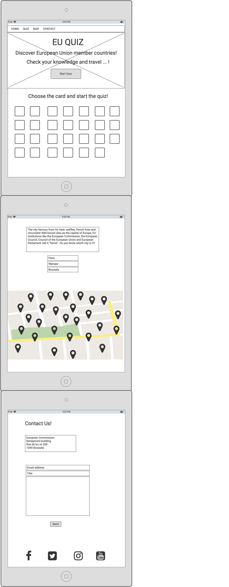
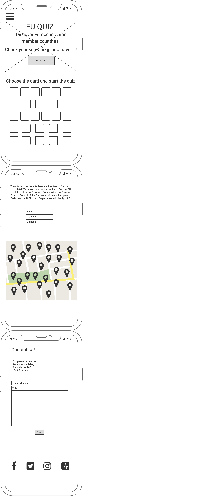

# EU QUIZ
## Do you know the capitals of the EU countries?

This project is a promotion of the EU member countries. Going through the quiz the participants need to answer the questions, which describes the capitals of the member countries. During one rotation of the quiz participant has to answer 10 questions. Every answer gives  1 point. 

The idea of the project is to promote the knowledge about the EU members countries. That can help also to find out the new facts about the European capitals and encourage the viewers to discover these cities and travel around the Europe. 

## User stories
### First Time Visitor Goals
1. *As a First Time Visitor*, I want to easily understand the main purpose of the site and take part in the quiz and check my knowledge about the subject. 
2. *As a First Time Visitor*, I want to be able to easily navigate throughout the site to take part in the quiz.
### Returning Visitor Goals
1. *As a Returning Visitor*, I want to take part in the quiz and systematize my knowledge about the EU members capitals. 
2. *As a Returning Visitor*, I want to find the best way to get in contact with the organisation with any questions I may have.
3. *As a Returning Visitor*, I want to check the localistaions of the cities on the map.  
4. *As a Returning Visitor*, I want to find community links.
### Frequent User Goals
1. *As a Frequent User*, I want to check to see if there are any newly added questions to the quiz.
2. *As a Frequent User*, I want to check to see if there are any new options and updates of the website, for example forums or newsletter I can sign up to. 
## Design
### Colour Scheme
The three main colours used are: yellow, blue and white.
### Typography
The Oswald font is the main font used throughout the whole website with Sans Serif as the fallback font in case for any reason the font isn't being imported into the site correctly. 
### Imagery
Imagery is important. The large, background image on the index.html page is use to catch the user's attention. 
## Wireframes
* Web page Wireframe 
 
* Tablet Wireframe 
 
* Mobile Wireframe 
 
## Features
The EU Quiz is a set of 27 questions, but during one deal the participants have to answer 10 random questions. The users need to answer all of the questions to get maximum amount of points. Every question describes different capital of european country that belongs to the EU. The quiz is dedicated to users, who would like to check they knowledge about european capitals, but also would like to learn new facts about them. This quiz might be useful during the travel, also becouse it contains the map with localizations of the european capitals. If the users have any concerns or questions, they can use the email form to contact with the organisation.
* Responsive on all device sizes
* Interactive elements
### Existing Features
#### Navigation Bar
* Featured on all four pages, the full responsive navigation bar includes links to the Home page, Quiz page, Map page and Contact page and the active icons to the social media, the links of them will open in new tabs. . Navigation bar is identical in each page to allow for easy navigation.
* This section will allow the user to easily navigate from page to page across all devices without having to revert back to the previous page via the ‘back’ button.
#### The home page 
* The home page includes a background image and the START QUIZ button, that allows redirection to the quiz page. 
#### The quiz page
* The quiz page contains the quiz form with the questions, that encourages user imediately to take part with the game.  
#### The map page
* The map page contains responsive Google map with pointers of european capitals. That helps users to find the looking city in the easy way.
#### The contact page
* The contact page gives the information about the organisation address and contains contact form, that allows to send the direct email and easly contact with the organisation. 
#### The footer section 
* The footer section includes flags of 27 countries of EU. The icons are active and redirect the user, after clicking on them, to the Wikipedia pages for getting more information about each country. The links will open in new tabs. Footer  is identical in each page to allow for easy navigation.

### Features Left to Implement
* Another feature idea, like: newsletter, more questions, diffrent levels of quiz. 

## Technologies Used
### Languages Used
* [HTML5](https://en.wikipedia.org/wiki/HTML5)
* [CSS3](https://en.wikipedia.org/wiki/CSS)
* [JavaScript](https://en.wikipedia.org/wiki/JavaScript)

### Frameworks, Libraries & Programs Used
1. [Bootstrap 5.0.2.](https://getbootstrap.com/docs/versions/):
* Bootstrap was used to assist with the responsiveness and styling of the website. Navbar and responsive images were created by using Bootstrap libraries.
2. [Hover.css](https://developer.mozilla.org/en-US/docs/Web/CSS/:hover):
* Hover.css was used on the buttons in the quiz to add the changing color options while being hovered over.
3. [Google Fonts](https://fonts.google.com/):
* Google fonts were used to import the 'Oswald' font into the style.css file which is used on all pages throughout the project.
4. [Font Awesome](https://fontawesome.com/):
* Font Awesome was used on all pages throughout the website to add icons of social media for aesthetic and UX purposes.
5. [Git](https://www.gitpod.io/):
* Git was used for version control by utilizing the Gitpod terminal to commit to Git and Push to GitHub.
6. [GitHub](https://github.com/):
* GitHub is used to store the projects code after being pushed from Git.
7.	[Balsamiq](https://balsamiq.com/):
* Balsamiq was used to create the wireframes during the design process.
## Testing
1. Browsers:
* Chrome
* Safari 
2. Bugs: 
3. Family & Friends
The Website was tested on Google Chrome and Safari browsers.
The website was viewed on a variety of devices such as Desktop, Laptop, iPhone7, iPhone 8 & iPhoneX.

In this section, you need to convince the assessor that you have conducted enough testing to legitimately believe that the site works well. Essentially, in this part you will want to go over all of your project’s features and ensure that they all work as intended, with the project providing an easy and straightforward way for the users to achieve their goals.
In addition, you should mention in this section how your project looks and works on different browsers and screen sizes.
You should also mention in this section any interesting bugs or problems you discovered during your testing, even if you haven't addressed them yet.
If this section grows too long, you may want to split it off into a separate file and link to it from here.
## Validator Testing
* HTML
o	No errors were returned when passing through the official W3C validator
* CSS
o	No errors were found when passing through the official (Jigsaw) validator
* JavaScript 

•	The Website was tested on Google Chrome, Internet Explorer, Microsoft Edge and Safari browsers.
•	The website was viewed on a variety of devices such as Desktop, Laptop, iPhone7, iPhone 8 & iPhoneX.
•	A large amount of testing was done to ensure that all pages were linking correctly.
•	Friends and family members were asked to review the site and documentation to point out any bugs and/or user experience issues.
### Unfixed Bugs
You will need to mention unfixed bugs and why they were not fixed. This section should include shortcomings of the frameworks or technologies used. Although time can be a big variable to consider, paucity of time and difficulty understanding implementation is not a valid reason to leave bugs unfixed.
## Deployment
This section should describe the process you went through to deploy the project to a hosting platform (e.g. GitHub)
•	The site was deployed to GitHub pages. The steps to deploy are as follows:
o	In the GitHub repository, navigate to the Settings tab
o	From the source section drop-down menu, select the Master Branch
o	Once the master branch has been selected, the page will be automatically refreshed with a detailed ribbon display to indicate the successful deployment.
The live link can be found here - https://code-institute-org.github.io/love-running-2.0/index.html

### Credits
#### Code:
* [Bootstrap](https://getbootstrap.com/docs/versions/) - liberies used through all pages to style elements: navigation bar, callout, buttons and email form.
* [Code Institute-1](https://learn.codeinstitute.net/courses/course-v1:CodeInstitute+IFD101+2017_T3/courseware/03d3f6524ad249d9b33e3336d156dfd0/3b2af8636ea54a4d9dc45126f7498633/) - learning materials from the course, how to create interactive Google Map.
* [Code Institute-2](https://learn.codeinstitute.net/courses/course-v1:CodeInstitute+IFD101+2017_T3/courseware/03d3f6524ad249d9b33e3336d156dfd0/e4710f80cdf34bffbd607bc102482d5c/) - learning materials from the course, how to create function send email.
* [EmailJs](https://www.emailjs.com/) - creating email in JavaScript.
* [Dev.to](https://dev.to/sulaimonolaniran/building-a-simple-quiz-with-html-css-and-javascript-4elp) - information and code used to create interactive quiz in JavaScript. 
#### Images:
* [Flaticon](https://www.flaticon.com/packs/countrys-flags) - source of all flags images used on the website. 
* [Unsplash](https://unsplash.com/) - the background image on the home page.
#### Content:
* [Wikipedia](https://www.wikipedia.org/) - information about the european countries.
* Information for the quiz questions coming from: [Kelayann.com](http://www.kaleyann.com/10-fun-facts-vienna/), [Meininger-hotels.com](https://www.meininger-hotels.com/blog/en/fun-facts-brussels/), [Travelwithwinny.com](https://www.travelwithwinny.com/bulgaria-sofia-travel/), [Timeout.com](https://www.timeout.com/croatia/news/10-secret-facts-about-zagreb-050920), [Cyhealthservices.com](https://www.cyhealthservices.com/news-events/39-5-interesting-facts-about-cyprus-you-probably-didn-t-know), [St-christophers.co.uk](https://www.st-christophers.co.uk/travel-blog/cool-facts-you-probably-didnt-know-about-prague), [Copenhagendowntown.com](https://www.copenhagendowntown.com/blog/8-fun-facts-about-copenhagen), [Blog.radissonblu.com](https://blog.radissonblu.com/tallinns-fun-facts/), [Justfunfacts.com](http://justfunfacts.com/interesting-facts-about-helsinki/), [Blog.aifsabroad.com](https://blog.aifsabroad.com/2019/05/10/10-fun-facts-about-athens-greece-that-you-might-not-know/), [Travelnotsandbeyond.com](https://travelnotesandbeyond.com/interesting-things-about-budapest/), [Viptaxis.ie](https://viptaxis.ie/fun-facts-dublin-2/), [Worldstrides.com](https://worldstrides.com/blog/2016/10/12-interesting-facts-about-rome/), [Isolatetraveller.com](https://www.isolatedtraveller.com/20-interesting-facts-about-riga/), [Worldscapitalcities.com](https://www.worldscapitalcities.com/capital-facts-for-vilnius-lithuania/), [Welcome-center-malta.com](https://www.welcome-center-malta.com/10-facts-about-valletta-you-didnt-know/), [Getyourguide.com](https://www.getyourguide.com/magazine/2020/03/amsterdam-fun-facts/), [Theculturetrip.com](https://theculturetrip.com/europe/portugal/lisbon/articles/10-facts-about-lisbon-that-you-never-knew/), [Solosophie.com](https://www.solosophie.com/fun-cool-weird-interesting-facts-about-bucharest/), [Total-slovenia-news.com](https://www.total-slovenia-news.com/lifestyle/485-25-things-to-know-about-ljubljana), [Traveltalktours.com](https://www.traveltalktours.com/11-astounding-facts-madrid/), [Nordicexperience.com](https://www.nordicexperience.com/know-25-fun-interesting-facts-stockholm-sweden/)
* [Font Awesome](https://fontawesome.com/) - social media icons used for styling the navigation bar. 
### Media:
* [Europa.eu](https://europa.eu/european-union/about-eu/symbols/anthem_en) - audio file with european anthem used, when the quiz is completed.
## Acknowledgements
My Mentor for helpful feedback.